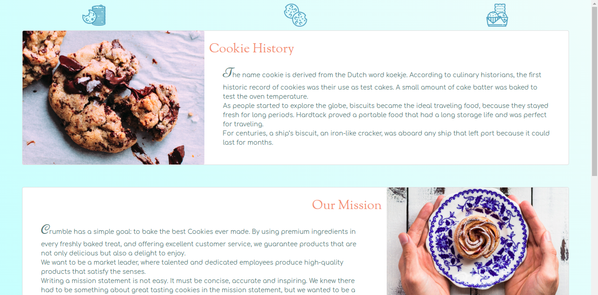
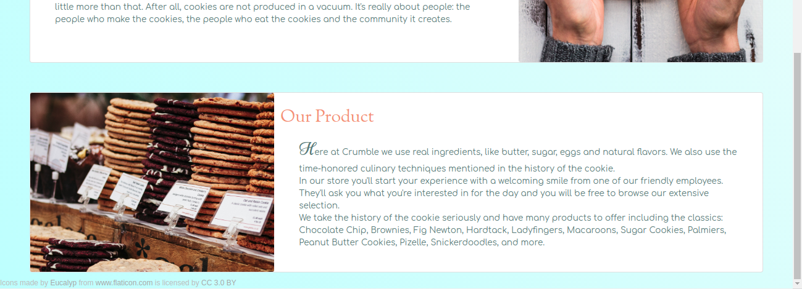

### That's the Way the Cookie Crumbles

## :cookie: Crumble
I was placed into a group of 4 persons to compile a website based on a made-up company. My group agreed to creating a cookie company named Crumble. The company is figuratively a cookie-giant who sells quality, made-with-love cookies and uses fresh ingredients sources from the best suppliers.
In the group, we were each assigned to create 1 of 4 pages of this company's website. I was assigned the informational page which includes History, Mission, and Product sections. I also included 3 icon buttons on top which scroll to their respective elements upon clicking.

**HERE** is the preview of the full website when put together.

This image shows the page I was responsible for.

## :eyeglasses: Sections
##### History
For this section I looked up the history of the cookie on google and included select text that I thought suited the project and company.
##### Mission
The mission statement is paraphrased mostly from different companies with different mission statements. I wanted to give the webpage an authentic feeling, as if it was for a real company.
##### Product
The product section includes information about Crumble's suppliers and sources, a breakdown of the planned customer experience, and a list of the types of cookies they provide with a strong emphasis on the history of the cookie.

## :pencil2:  How the Website Works
As a display, the website consists of three icon buttons aligned in the center at the top of the page, then 3 cards: the 1st is image-left and tex-right for the *Cookie History* section. The 2nd is text-left and image-right for the *Our Mission* section. The 3rd is image-left and text-right for the *Our Product* section.

XL - LG | MD - SM |
--- | --- 
Horizontal cards | Vertical cards
Images to left and right | Images on top of cards
Icon buttons on top | Icon buttons hidden   

The website is responsive. In the default stage (xl-lg) the icons at the top scroll smoothly to sections 1, 2, and 3 respectively. At the 2nd stage (xs-md) these icons become hidden and the cards become vertical and stack on top of each other.
